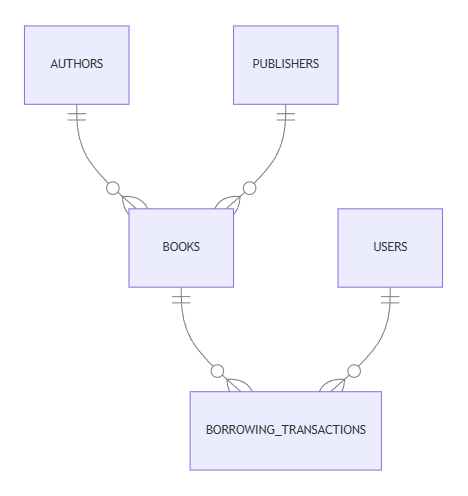

# Library Management System Database

By ANAM ZAHID

## Scope

This Library Management System (LMS) database schema is designed to efficiently manage various aspects of a library, including user data, book information, authors, publishers, transactions (borrows and returns), and the availability status of books.As such, included in the database's scope is:

* Users, including both member and staff with baisc identifying information.
* Authors, including basic idenitfying information.
* Publishers, including name and some description.
* Books, including associated relevant information like author, publisher, genre etc.

Out of the scope are borrowing charge, fine, due date, borrowing rules.

## Functional Requirements

This database will support:

* CRUD operations for users, books, authors and publishers.
* Availability status of books.
* Keep track of borrowed books, date and the user who borrowed.

## Representation

Information is captured in MYSQL database with the following schema.

### Entities

The database includes the following entities:

#### 1. Users

The `users` table contains the following columns

* `id`: A unique identifier for each user (auto-incremented).
* `first_name`: User's first name (non-nullable).
* `last_name`: User's last name (non-nullable).
* `email`: User's email address (non-nullable and unique).
* `phone_number`: User's phone number (non-nullable).
* `address`: User's address (optional).
* `role`: Specifies if the user is a 'member' or 'staff' (non-nullable).

#### 2. Authors

The `authors` table contains the following columns

* `id`: A unique identifier for each author (auto-incremented).
* `name`: The name of the author (non-nullable).
* `birth_year`: The birth year of the author (optional).
* `bio`: A short biography of the author (optional).

#### 3. Publishers

The `publishers` table contains the following columns

* `id`: A unique identifier for each publisher (auto-incremented).
* `name`: The name of the publisher (non-nullable).
* `bio`: A short biography of the publisher (optional).

#### 4. Books

The `books` table contains the following columns

* `id`: A unique identifier for each book (auto-incremented).
* `title`: The title of the book (non-nullable).
* `author_id`: Foreign key referencing the authors table.
* `publisher_id`: Foreign key referencing the publishers table.
* `publication_year`: The year the book was published (optional).
* `genre`: The genre of the book (optional).
* `availability_status`: The availability of the book, either 'available' or 'not_available' (default is 'available').

#### 5. Borrowing Transactions Table

The `borrowing_transactions` table contains the following columns

* `id`: A unique identifier for each transaction (auto-incremented).
* `user_id`: Foreign key referencing the users table.
* `book_id`: Foreign key referencing the books table.
* `date_time`: The date and time of the transaction (default is the current timestamp).
* `action`: The action performed, either 'Borrowed' or 'Returned' (non-nullable).

### Relationships

As detailed by the diagram:

* The Users table is connected to the Borrowing_Transactions table through a one-to-many relationship. This means that a single user can perform multiple transactions, such as borrowing or returning books.

* The Books table is also linked to the Borrowing_Transactions table in a one-to-many relationship. Each book can be borrowed and returned multiple times, and every transaction record refers to a specific book.

* The Authors table has a one-to-many relationship with the Books table. An author can write multiple books, but each book is written by a single author.

* The Publishers table is similarly connected to the Books table through a one-to-many relationship. A publisher can publish multiple books, but each book is published by a single publisher.

In this structure, the Books table serves as a central entity, linking authors, publishers, and transactions. The Borrowing_Transactions table functions as a junction between users and books, recording each borrowing and return action.

## Optimizations

### Indexes

* `index_authors_name on authors(name)`: Speeds up searches for authors by their names, such as when querying books written by a specific author.
* `index_publishers_name on publishers(name)`: Improves performance for queries involving publisher names, such as retrieving books by a specific publisher.
* `idx_books_author_id on books(author_id)`: Optimizes searches for books based on their authors, as author_id is a foreign key in the books table.
* `idx_books_publisher_id on books(publisher_id)`: Enhances the speed of lookups for books associated with specific publishers.
* `idx_books_availability_status on books(availability_status)`: Facilitates quick filtering of books by availability, such as checking for available or borrowed books.
* `idx_borrowing_transactions_user_id on borrowing_transactions(user_id)`: Improves performance when retrieving transaction history for a specific user.
* `idx_borrowing_transactions_book_id on borrowing_transactions(book_id)`: Speeds up searches for transactions involving specific books.

### Triggers

* `book_status_update`: This trigger automatically updates the availability status of books in the books table when a borrow or return transaction is recorded in the `borrowing_transactions` table. After Insert, whenever a new row is inserted into the `borrowing_transactions` table, this trigger checks the action field: If the action is 'Borrowed', the availability status of the corresponding book is set to 'not_available'. If the action is 'Returned', the availability status is set to 'available'.

### Views

* `available_books`: This view lists all the books that are currently available for borrowing.
* `borrowed_books`: This view lists all the books that have been borrowed by users and are not currently available.
* `members`: This view lists all users who are registered as members.
* `staff`: This view lists all users who are registered as staff.

### Stored Procedures

* `user_borrowing_history`: This stored procedure shows the borrowing history for a specific user, identified by their email address.
* `book_by_author`: This stored procedure shows all books by a given author.
* `book_by_publisher`: This stored procedure returns all books published by a given publisher.

## Limitations

* Given schema doesn't take into account for due dates, any notification mechanism and charges or fine related any to book borrowing transactions.
* It is assumed that one book will have one and only one author. So books authored by more than one author is not taken into account. Similar argument also hols true for publisher as well.

## Acknowledgment:

* #### CS50 Duck
    The duck has been a GREAT help! Saved a lot of time by helping in finding required libraries, helping with syntax usage and finding typos. Thus I could invest my time to focus more on core logic.
